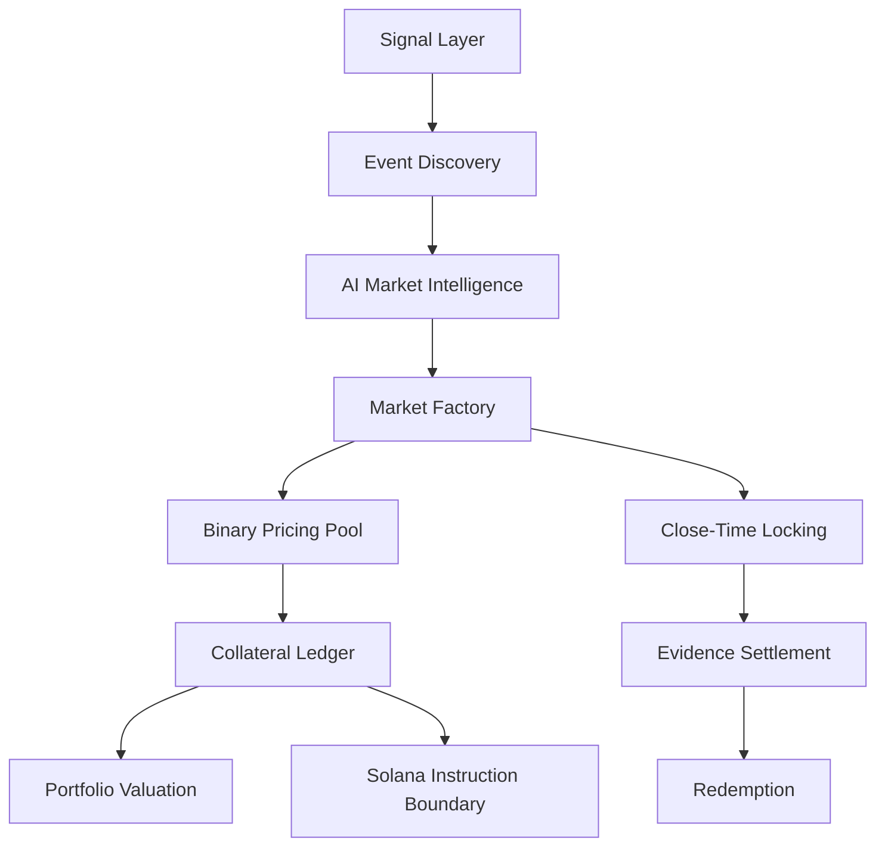
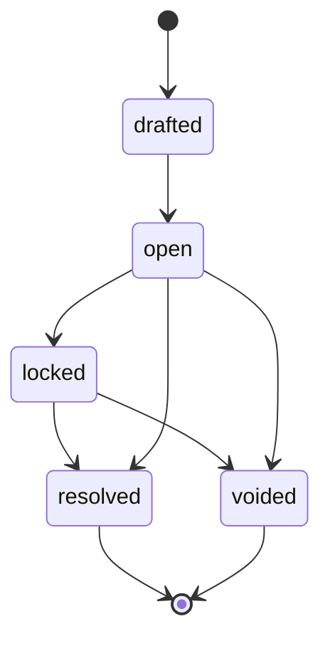
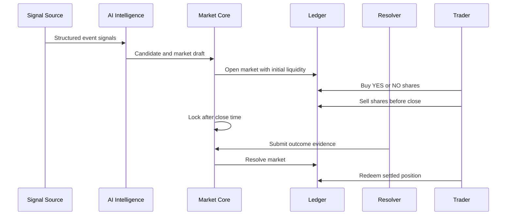

# Fate Market

`$FATE`

Trade the future. Price reality on Solana.


Fate Market is an AI event prediction market for Solana. Users trade YES and NO outcome shares around future events. Market prices express live probability, AI turns information into structured market intelligence, and the protocol core maintains event discovery, market creation, trading, custody accounting, settlement, and redemption state.

## Table of Contents

- [Overview](#overview)
- [Project Links](#project-links)
- [Project Highlights](#project-highlights)
- [First Principles](#first-principles)
- [Technical Architecture](#technical-architecture)
- [Core Modules](#core-modules)
- [Protocol Flow](#protocol-flow)
- [Repository Structure](#repository-structure)
- [Installation](#installation)
- [Configuration](#configuration)
- [Usage](#usage)
- [Scripts](#scripts)
- [Brand Assets](#brand-assets)
- [Project Progress](#project-progress)
- [Roadmap](#roadmap)
- [FAQ](#faq)
- [License](#license)

## Overview

Fate Market converts real-world information into tradable event markets. The protocol follows a clear loop:

```text
signals -> event candidates -> AI market intelligence -> YES / NO market -> trades -> locked market -> evidence -> settlement -> redemption
```

The current codebase implements the MVP protocol core in TypeScript. It exposes deterministic modules for event discovery, AI market drafting, binary pricing, account ledgers, open position exits, close-time locking, portfolio valuation, resolution evidence, redemption, and Solana instruction construction.

## Project Links

| Resource | Link |
| --- | --- |
| Website | https://www.fatemarket.fun/ |
| X / Twitter |  |
| GitHub Repository | https://github.com/knimestrom/FATE.git |

## Project Highlights

- AI-driven event candidate discovery from structured signals.
- Binary YES / NO market drafting with probability, catalysts, risk notes, and thesis generation.
- Constant-product style binary pool for outcome share pricing.
- Buy and sell execution for active markets.
- Collateral ledger with positions, trade history, and fee accounting.
- Portfolio valuation against current market prices.
- Close-time market locking.
- Evidence-based YES, NO, and VOID settlement.
- Redemption logic for winning or voided shares.
- Solana instruction builders for open, buy, sell, resolve, and redeem actions.
- Bundled Fate Market logo, favicon, and brand metadata.
- Deterministic test coverage for the protocol lifecycle.

## First Principles

A prediction market is not just a market card. A working event market needs:

1. A future event with a precise resolution condition.
2. Two mutually exclusive outcome claims.
3. Collateral bound to those claims.
4. A pricing function that changes as traders take risk.
5. A position ledger that protects account balances.
6. A close-time rule that stops new trades before resolution.
7. Evidence that maps the event outcome to settlement.
8. A redemption path that pays the winning side.

Fate Market builds the MVP from those primitives first. Frontend surfaces, AI providers, indexers, and Solana adapters can consume the same protocol modules without changing the market model.

## Technical Architecture

### Stack

- Runtime: Node.js
- Language: TypeScript
- Module system: ESM
- Test runner: Node.js built-in test runner
- Type execution for tests: `tsx`
- Build output: `dist`
- Brand assets: PNG logo and favicon

### Architecture Layers



### State Model



### Data Flow



## Core Modules

| Module | Purpose |
| --- | --- |
| `src/core/brand.ts` | Exposes Fate Market brand metadata and bundled asset paths. |
| `src/core/types.ts` | Defines protocol types for events, markets, trades, ledgers, portfolios, and settlement. |
| `src/core/events.ts` | Discovers event candidates from structured signal inputs. |
| `src/core/ai.ts` | Creates market questions, probability estimates, YES thesis, NO thesis, catalysts, and risk notes. |
| `src/core/pricing.ts` | Quotes and applies YES / NO buy and sell actions. |
| `src/core/ledger.ts` | Maintains accounts, collateral, positions, trade history, fees, exits, and redemption. |
| `src/core/markets.ts` | Opens markets, validates close times, locks expired markets, and creates public snapshots. |
| `src/core/portfolio.ts` | Marks account positions against current market prices. |
| `src/core/settlement.ts` | Resolves markets with evidence and reliability thresholds. |
| `src/core/solana.ts` | Builds chain-facing Fate Market instructions. |
| `src/core/protocol.ts` | Composes the full protocol lifecycle into one stateful API. |
| `src/data/seed-signals.ts` | Provides deterministic signal data for development and tests. |

## Protocol Flow

### 1. Signal Ingestion

Signals can represent news, social activity, onchain movement, market data, or manual operator input. Each signal carries source, strength, tags, and supporting evidence.

### 2. Event Discovery

The event engine groups related signals, scores heat and confidence, and emits event candidates.

### 3. AI Market Intelligence

The AI layer transforms a candidate into a binary market draft. The draft includes question wording, close time, resolution rules, probability, YES case, NO case, catalysts, and risk notes.

### 4. Market Opening

The market factory validates the close time, creates a binary pool, assigns initial liquidity, and stores the market in protocol state.

### 5. Trading

Traders can buy YES or NO shares. Trades update pool liquidity, account positions, volume, trade count, and collected fees.

### 6. Position Exit

Before close, traders can sell YES or NO shares back into the pool to reduce exposure.

### 7. Locking

After close time, the market locks. New trades are rejected, and the market is ready for outcome resolution.

### 8. Settlement

Resolvers submit evidence and an outcome. The settlement layer supports YES, NO, and VOID, with evidence reliability checks for non-VOID outcomes.

### 9. Redemption

After resolution, accounts redeem winning shares or voided shares back into collateral.

## Repository Structure

```text
.
|-- assets/
|   `-- brand/
|       |-- fate-market-favicon.png
|       `-- fate-market-logo.png
|-- docs/
|   |-- architecture.md
|   |-- brand-assets.md
|   `-- mvp-scope.md
|-- public/
|   |-- favicon.png
|   `-- logo.png
|-- src/
|   |-- core/
|   |   |-- ai.ts
|   |   |-- brand.ts
|   |   |-- events.ts
|   |   |-- ledger.ts
|   |   |-- markets.ts
|   |   |-- portfolio.ts
|   |   |-- pricing.ts
|   |   |-- protocol.ts
|   |   |-- settlement.ts
|   |   |-- solana.ts
|   |   |-- types.ts
|   |   `-- utils.ts
|   |-- data/
|   |   `-- seed-signals.ts
|   `-- index.ts
|-- tests/
|   `-- protocol.test.ts
|-- LICENSE
|-- README.md
|-- package.json
`-- tsconfig.json
```

## Installation

### Requirements

- Node.js 20 or newer
- npm 10 or newer

### Install Dependencies

```bash
npm install
```

### Build

```bash
npm run build
```

The compiled package is emitted to `dist`.

## Configuration

The MVP core is deterministic and does not require secrets to run. Downstream apps can provide environment variables for deployment and service adapters.

Recommended application variables:

```bash
FATE_SITE_URL=https://www.fatemarket.fun
FATE_SOLANA_NETWORK=mainnet-beta
FATE_PROGRAM_ID=fate_market
FATE_TREASURY_ACCOUNT=<treasury-account>
FATE_RESOLVER_ACCOUNT=<resolver-account>
```

These variables are consumed by application adapters, indexers, or clients that wrap the protocol core.

## Usage

### Import the Protocol

```ts
import {
  createFateMarketProtocol,
  createMarketFromEvent,
  exitPosition,
  fundAccount,
  getPortfolio,
  ingestSignals,
  listMarkets,
  redeem,
  seedSignals,
  settle,
  trade
} from "fate-market";
```

### Run a Full Market Lifecycle

```ts
const state = createFateMarketProtocol();

const [event] = ingestSignals(state, seedSignals);
const market = createMarketFromEvent(state, event, "2026-05-31T00:00:00.000Z", {
  initialLiquidity: 1000,
  feeBps: 30
});

fundAccount(state, "trader-1", 500);

const buy = trade(state, market.id, "trader-1", "YES", 100);
exitPosition(state, market.id, "trader-1", "YES", buy.sharesOut / 4);

const portfolio = getPortfolio(state, "trader-1");

settle(state, market.id, "YES", "fate-oracle");
const payout = redeem(state, market.id, "trader-1");

console.log({ markets: listMarkets(state), portfolio, payout });
```

### Build Solana Instructions

```ts
import {
  buildBuySharesInstruction,
  buildOpenMarketInstruction,
  createFateMarketProtocol,
  createMarketFromEvent,
  fundAccount,
  ingestSignals,
  seedSignals,
  trade
} from "fate-market";

const state = createFateMarketProtocol();
const [event] = ingestSignals(state, seedSignals);
const market = createMarketFromEvent(state, event, "2026-05-31T00:00:00.000Z");

fundAccount(state, "trader-1", 500);
const quote = trade(state, market.id, "trader-1", "YES", 100);

const openIx = buildOpenMarketInstruction(market, "treasury-account");
const buyIx = buildBuySharesInstruction(market, "trader-1", "YES", quote);

console.log(openIx, buyIx);
```

### Read Brand Metadata

```ts
import { fateMarketBrand } from "fate-market";

console.log(fateMarketBrand.name);
console.log(fateMarketBrand.assets.logo);
```

## Scripts

| Command | Purpose |
| --- | --- |
| `npm test` | Runs deterministic protocol tests. |
| `npm run typecheck` | Runs TypeScript validation without emitting files. |
| `npm run build` | Compiles the TypeScript package to `dist`. |

## Testing

The test suite covers:

- Bundled brand assets.
- Event discovery and market opening.
- YES buy flow and price movement.
- Sell-side position exits.
- Portfolio valuation.
- Market close-time locking.
- Invalid state rejection.
- Evidence-based settlement and redemption.

Run:

```bash
npm test
```

## Brand Assets

| Resource | Value |
| --- | --- |
| Full name | Fate Market |
| Ticker | `$FATE` |
| Network | Solana |
| Website | https://www.fatemarket.fun/ |
| X / Twitter |  |
| GitHub Repository | https://github.com/knimestrom/FATE.git |

| Asset | Path |
| --- | --- |
| Primary logo | `assets/brand/fate-market-logo.png` |
| Favicon | `assets/brand/fate-market-favicon.png` |
| Public logo | `public/logo.png` |
| Public favicon | `public/favicon.png` |

The same asset paths are exported by `fateMarketBrand`.

## Project Progress

### Completed

- Protocol type system.
- Event signal ingestion.
- Event candidate discovery.
- AI market intelligence generation.
- Binary YES / NO market creation.
- Buy-side and sell-side trading.
- Collateral ledger and fee accounting.
- Portfolio valuation.
- Market close-time locking.
- Evidence-based settlement.
- Redemption after settlement.
- Solana instruction builders.
- Brand asset bundling.
- Deterministic protocol tests.
- TypeScript build output.

### Active Focus

- Provider adapters for live event feeds.
- Solana program client wiring around exported instruction builders.
- Frontend trading interface integration.
- Persistent storage for markets, trades, accounts, and resolutions.
- Resolver operations and evidence review workflow.

## Roadmap

### Phase 1: Protocol Core - April 2026

- Event candidates.
- Market drafting.
- Binary pricing.
- Ledger accounting.
- Trading, locking, settlement, and redemption.

### Phase 2: Trading App - May 2026

- Wallet connection.
- Market list and detail views.
- Trading ticket.
- Portfolio page.
- Resolution history.
- Brand-complete public interface.

### Phase 3: Data and AI Adapters - June 2026

- News feed adapters.
- Social signal adapters.
- Onchain signal adapters.
- Market data adapters.
- AI scoring and explanation adapters.

### Phase 4: Solana Execution - July 2026

- Program client.
- Transaction assembly.
- Treasury accounts.
- Market vault accounts.
- Resolver permissions.
- Settlement and redemption transactions.

### Phase 5: Operations - August 2026 and Beyond

- Monitoring.
- Market review tooling.
- Risk controls.
- Audit trail exports.
- Public analytics.

## Project Features

### Product Features

- Trade future event outcomes.
- Read AI-generated YES and NO cases.
- Price probability through market action.
- Exit open positions before close.
- Redeem settled positions.
- Track portfolio value.

### Protocol Features

- Deterministic state transitions.
- Fee accounting.
- Close-time enforcement.
- Evidence reliability checks.
- Solana instruction boundary.
- Public market snapshots.

### Developer Features

- Small TypeScript modules.
- ESM exports.
- Strict typing.
- Deterministic tests.
- Bundled brand assets.
- Clear docs and examples.

## FAQ

### What is Fate Market?

Fate Market is an AI event prediction market for Solana. It turns event signals into binary markets where users trade YES and NO outcome shares.

### What does `$FATE` represent?

`$FATE` is the project ticker and brand shorthand for Fate Market.

### Why YES and NO shares?

YES and NO shares make event probability tradable. If YES trades near 0.70, the market is pricing roughly a 70 percent chance of the event resolving YES.

### What does the AI layer do?

The AI layer converts event candidates into market intelligence. It creates market wording, probability estimates, YES thesis, NO thesis, catalysts, and risk notes.

### How does pricing work?

The pricing module uses a binary liquidity pool. Buying YES increases the YES price, buying NO increases the NO price, and selling shares moves price in the opposite direction.

### How does settlement work?

A resolver submits evidence and an outcome. Markets can resolve YES, NO, or VOID. Non-VOID outcomes require evidence reliability above the protocol threshold.

### Can users exit before settlement?

Yes. Traders can sell YES or NO shares back into the pool while the market is open.

### What happens after market close?

The market locks. New trades are rejected, and the market waits for resolution evidence.

### How are Solana actions represented?

The Solana module builds chain-facing Fate Market instructions for open, buy, sell, resolve, and redeem actions.

### Where are the logo files?

The primary logo is stored at `assets/brand/fate-market-logo.png`, and the public web alias is stored at `public/logo.png`.

## Security Notes

- Account collateral is checked before buys.
- Share balances are checked before sells.
- Trades are rejected after close-time locking.
- Settlement requires evidence.
- Low-reliability evidence is rejected for YES and NO outcomes.

## License

This project is released under the [MIT License](./LICENSE).
