# Architecture

Fate Market starts from the event market itself, not from the webpage.

## Lifecycle

```mermaid
flowchart LR
    A["Signal input"] --> B["Event candidate"]
    B --> C["AI market intelligence"]
    C --> D["Open binary market"]
    D --> E["YES / NO trades"]
    E --> F["Position exit"]
    F --> G["Custody ledger"]
    G --> H["Market lock"]
    H --> I["Resolution evidence"]
    I --> J["Payout redemption"]
```

## Core Objects

### Event candidate

An event candidate is a cluster of signals with enough heat and confidence to become tradable.

### Market intelligence

Market intelligence records the generated question, probability estimate, YES thesis, NO thesis, catalysts, and risk notes.

### Binary pool

The binary pool maintains YES and NO liquidity. Buying YES removes YES liquidity and adds NO-side collateral pressure, raising YES probability. Buying NO performs the inverse operation.

### Ledger

The ledger owns account collateral, per-market positions, executed trades, and redemption after settlement.

### Position exit

Open positions can be sold back into the binary pool before close. This gives traders a way to manage risk before final resolution.

### Market lock

Markets lock after close time. New trades are rejected after lock, while settlement can still proceed from the locked state.

### Settlement

Settlement requires evidence. Resolvers can settle to YES, NO, or VOID. Winning shares redeem at one collateral unit per share. VOID redeems both sides.

### Solana boundary

The Solana boundary converts protocol actions into chain-facing Fate Market instructions:

- `open_market`
- `buy_shares`
- `sell_shares`
- `resolve_market`
- `redeem`

This keeps product, AI, pricing, custody, and chain execution aligned around the same state transitions.
